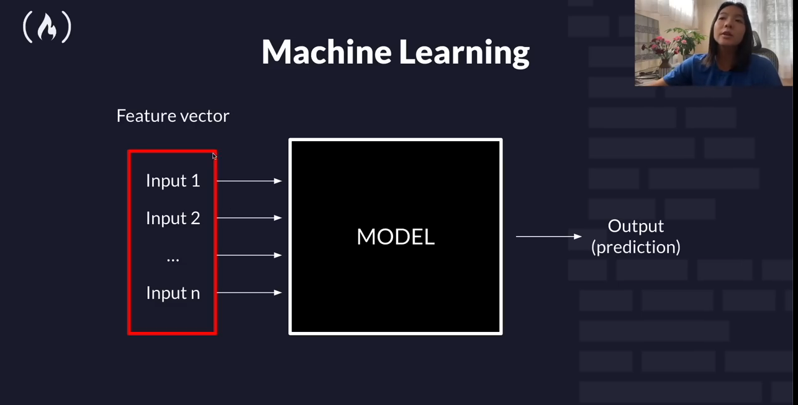

## Features Vector

## Features
1. Qualitative
    * categorical data (finite number of categories or    group)
    * Normal Data (No inherent order)

+ `One-Hot Encoding`\
[USA, India, Canada, France]
=>
"1"   if matches category  

ONE-HOT ENCODING
| **USA**    	| **[1,0,0,0]** 	|
|------------	|---------------	|
| **India**  	| **[0,1,0,0]** 	|
| **Canada** 	| **[0,0,1,0]** 	|
| **France** 	| **[0,0,0,1]** 	|

`One Hot Encoder is used to convert Categorical features into numerical values.`

2. Qualitative
    * numerical valued data (could be discrete or continuous  )